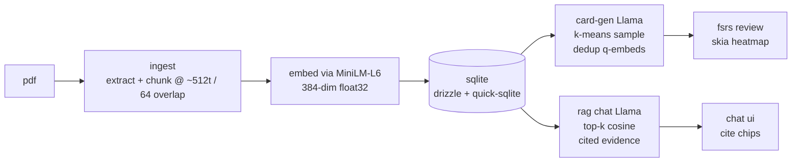

# studybuddy

> On-device RAG study app for iOS and Android. Drop in a PDF, get FSRS-scheduled
> flashcards back, and chat with the document. Nothing leaves the phone.

[](./LICENSE)
[](#quick-start)
[](#roadmap-v02)
[](#privacy)

- **Local LLM** (Llama 3.2 3B, 4-bit, swappable to Phi-3.5 / Gemma 2 / Llama 1B)
- **Local embeddings** (MiniLM-L6-v2)
- **FSRS-4.5** spaced repetition (the algorithm Anki ships as default since 23.10)
- **React Native + Skia + Reanimated 4 + ExecuTorch**
- **MIT licensed**, no network, no telemetry, no accounts

## Contents

- [Pipeline](#pipeline)
- [Quick start](#quick-start)
- [Models](#models)
- [Screenshots](#screenshots)
- [Project layout](#project-layout)
- [Privacy](#privacy)
- [Roadmap (v0.2)](#roadmap-v02)

## Pipeline



## Quick start

Requirements: Node 20+, pnpm 9+, Xcode 16+ (iOS) or Android Studio Koala+
(Android), `eas-cli` for the build flow.

```bash
pnpm install
pnpm typecheck    # zero errors
pnpm test         # ~100 vitest cases, ~500ms
```

Run on a device or simulator (requires a dev client, since we depend on
native modules: quick-sqlite, mmkv, executorch, skia):

```bash
# ios (one-time: pnpm dlx expo prebuild --platform ios)
pnpm ios

# android (one-time: pnpm dlx expo prebuild --platform android)
pnpm android
```

By default the app runs with **mock models** so you can iterate end-to-end
without downloading any model files. To exercise the real LLM + embedder:

```bash
EXPO_PUBLIC_USE_REAL_MODELS=1 pnpm ios
```

Then go to Settings → Models and download Llama 3.2 3B + MiniLM-L6.

## Models

<details>
<summary><b>Catalog</b> — five on-device models, swap from Settings → Models</summary>

Every file is downloaded once on first run, stored under
`/Documents/sb/models/<filename>.pte`, and SHA-256 verified before being
marked installed. Mismatched bytes are deleted; the app prompts to retry.

| id                              | kind  | size    | license                       |
|---------------------------------|-------|---------|-------------------------------|
| `llama-3.2-3b-instruct-q4`      | llm   | ~2.5 GB | Llama 3 Community License     |
| `phi-3.5-mini-q4`               | llm   | ~2.4 GB | MIT                           |
| `gemma-2-2b-q4`                 | llm   | ~1.8 GB | Gemma Terms of Use            |
| `llama-3.2-1b-q4`               | llm   | ~0.9 GB | Llama 3 Community License     |
| `all-minilm-l6-v2`              | embed | ~25 MB  | Apache 2.0                    |

Source URLs and expected hashes live in [`src/services/models.service.ts`](./src/services/models.service.ts).

</details>

<details>
<summary><b>Choosing a model</b> — quality vs. speed vs. device class</summary>

- **Llama 3.2 3B** — default. Best quality / speed tradeoff on flagship phones (iPhone 15 Pro, Galaxy S24+). ~20 tok/sec.
- **Phi-3.5 mini** — slightly better at structured JSON output, similar size, similar speed. Try if you see card-gen JSON parse failures.
- **Gemma 2 2B** — fastest of the bunch. Cards are slightly shorter + blunter; great for grinding through large docs.
- **Llama 3.2 1B** — for low-end devices. Card quality suffers; RAG citations still land.
- **MiniLM-L6** — the only embedder. 384-dim, fast, multilingual-OK.

</details>

<details>
<summary><b>Running with mock models</b> — drive every screen end-to-end without downloading 2.5 GB</summary>

The default dev build sets `EXPO_PUBLIC_USE_REAL_MODELS=0`. The embed service hashes inputs into deterministic 384-dim vectors; the LLM service emits canned JSON for card-gen prompts and a one-line RAG-shaped answer for everything else. The mock path is enough to drive every screen end-to-end.

Flip the env var to load the real models:

```
EXPO_PUBLIC_USE_REAL_MODELS=1 pnpm ios
```

</details>

## Screenshots

Drop screenshots into [`screenshots/`](./screenshots/) and they show up here:

- `screenshots/library.png` — the library after a sample import
- `screenshots/review.png` — swipe-to-grade with the FSRS state badge
- `screenshots/heatmap.png` — Skia review heatmap
- `screenshots/chat.png` — RAG chat with inline page-cite chips

## Project layout

```
app/                  expo-router screens (file system routing)
  (tabs)/             library / decks / review / chat
  settings/           model picker, storage, danger zone
  onboarding/         welcome -> models -> sample
src/
  components/         pure RN UI (card, heatmap, retention-curve, …)
  services/           pdf, chunker, embed, llm, vector-store, rag, card-gen, …
  stores/             zustand (library, deck, review, chat, settings)
  db/                 drizzle schema + sqlite client + migrations
  prompts/            versioned LLM prompts (card-gen.v1, rag-answer.v1)
  lib/                pure helpers — cosine, kmeans, fsrs, chunker, id
  hooks/              react query + small ui hooks
  types/              zod schemas (shared with services)
e2e/                  maestro yaml flows
docs/                 architecture, prompts, models
assets/               sample.pdf, icons, fonts
```

## Privacy

studybuddy never makes network requests once models are downloaded. There
is no analytics, no crash reporting service, no account system. Your
documents and review history live in your app sandbox.

The model download (first run) is the only network activity — it's a HEAD
request for size, then a resumable download from Hugging Face, then a
SHA-256 verify. Source URLs and hashes live in [`src/services/models.service.ts`](./src/services/models.service.ts).

## Roadmap (v0.2)

These are explicit non-goals for v0.1 — landing in v0.2.

- [ ] **Custom TurboModule PDF parsers** wrapping PDFKit (iOS) and PdfBox (Android) for messy real-world PDFs that `react-native-pdf-extract` doesn't handle well.
- [ ] **OCR fallback** for scanned PDFs (Vision framework on iOS, ML Kit on Android).
- [ ] **EPUB import**.
- [ ] **Voice chat with the doc** via Whisper + an on-device TTS.
- [ ] **Image-bearing cards** for diagrams.
- [ ] **Tailscale-mediated sync** between phone and desktop — never via a third-party server.
- [ ] **Per-user FSRS optimization** — the `optimize()` stub already shipped in `lib/fsrs.ts` reports log-loss; the L-BFGS-B fitting follows once a user has 1000+ reviews logged.
- [ ] **Multi-doc decks** ("everything I read about kubernetes").

## License

MIT · [@mateokadiu](https://github.com/mateokadiu) · Models retain their own licenses (Llama Community, Apache 2.0, Gemma Terms of Use).
